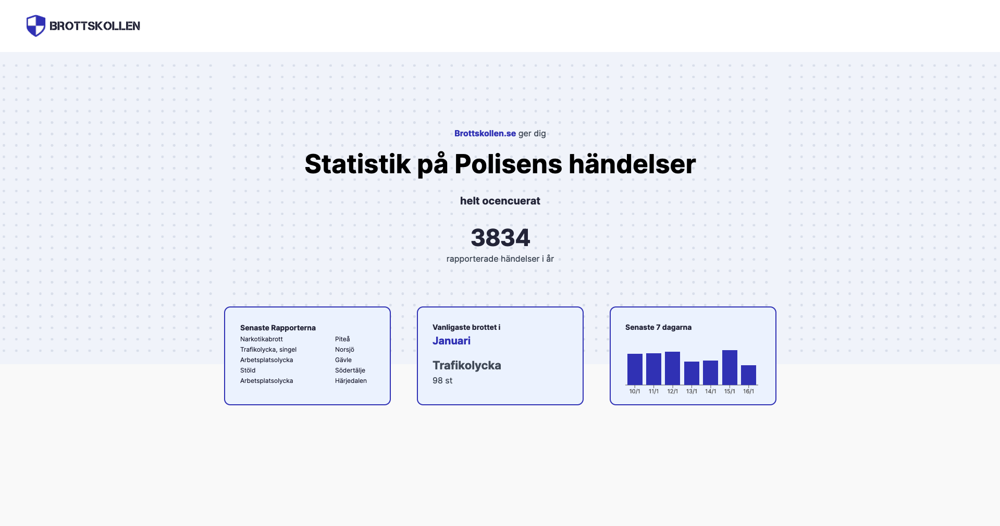
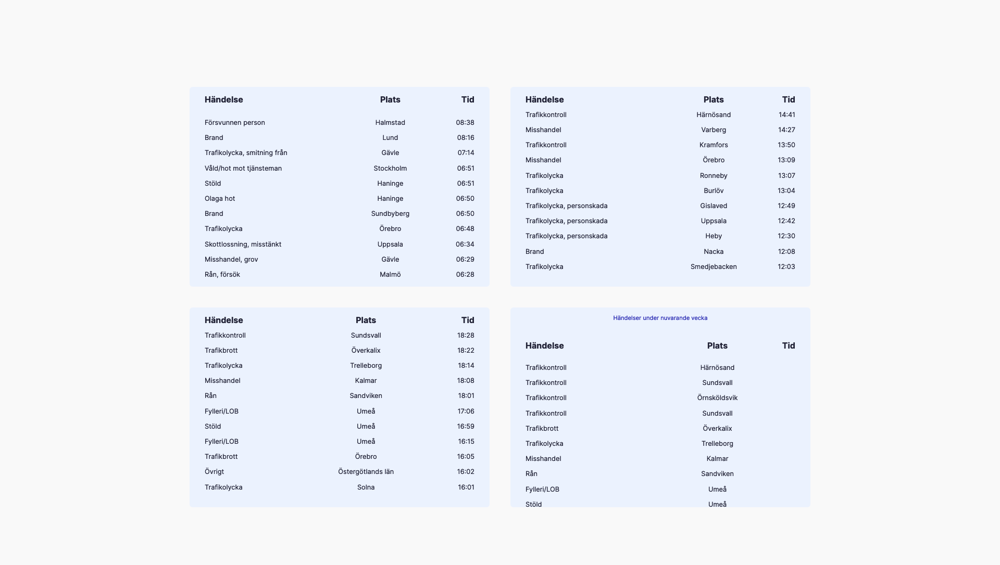

# Brottskollen

The idea for Brottskollen stemmed from mainly becuase I needed a project that would challenge me, where I could utilize the technology I've studied and also put myself in situations I haven’t encountered before, requiring me to find solutions independently. This is my first major project, built after studying front-end development (HTML, CSS, JavaScript, REACT) for 4-9 months.

Tech used

- Java Script
- React
- Node
- Express
- Tailwind

>

    🧱 The information below is a breakdown of the site and some components.

>

## Wanted to achive

- Get better at building components
- Get better at understanding REST API
- Try tailwind and see if I like it (I did)
- Build a fullstack project

## What it is

Brottskollen is a page that recive data from the police API and make display the data in a easy and understandble way.

The page is built in 6 different section that provide data.

### Header



It shows you total reports that has been made this year and updates every 60 seconds. It gives you a small preview of:

- Latest reports
- Which month we are in and which crime/report is most common
- A diagram over the lastest 7 days from today. If you user hover, they can see the data the diagram is showing.

### Tables



The next section is just tables showing you which crimes was repported under different parts of the day. We also have a table showing you all the reports of the week, so that tables grow for every hour and day. On Sunday 00:00 will it restart and get empty.

The tables are split in four different time-section over the day.

- Morning: 06:00 - 12:00
- Evning: 12:00 - 17:00
- Noon: 17:00 - 23:59

  #### API

  I built one API which is a get.

```js
router.get("/sumUp/:function", (req, res) => {
  const functionMap = {
    sumUp_Morning: sumUp_Morning,
    sumUp_Afternoon: sumUp_AfterNoon,
    sumUp_Evning: sumUp_Evning,
    sumUp_Weekend: sumUp_Weekend,
    sumUp_Week: sumUp_Week,
  };

  const funcName = req.params.function;

  if (functionMap.hasOwnProperty(funcName)) {
    console.log("den har funktionen som skickas in");
    functionMap[funcName](req, res); // Runs the function
  } else {
    res.status(404).send("Function not found");
  }
});
```

The API URI is build up that we send the function that should be used. In the callback we us a mapping-object to confirm that we get a function and then we call it.

The tables is built threw one component that takes in different props.

```js
<SumUpTable
  timeOfDay="12:00 - 17:00"
  apiCall="sumUp_Afternoon"
  noDataMsg="No data to be shown"
/>;

//Inside of the component
import { useEffect, useState } from "react";

export default function SumUpTable({ timeOfDay, apiCall, noDataMsg }) {
  const [docArray, setDocArray] = useState([]); //handle/hold MONGO DB documents

  useEffect(() => {
    const data = async () => {
      const res = await fetch(`http://localhost:3000/sumUp/${apiCall}`);
      const data = await res.json();
      setDocArray(data);
    };
    data();
  }, []); // run useEffect when the page renders

  if (noDataMsg && docArray.length < 1) {
    return;
  } // do not render a table if the response is null or empty array

  return (
    <div className=" bg-light-bg px-5 w-full max-h-96 overflow-scroll lg:max-w-xl rounded-md">
      <table className="table-auto border-separate border-spacing-2 w-full pb-5">
        <caption className="caption-top py-3 scroll-py-3 text-[0.7rem] text-main-color bg-light-bg">
          Händelser {timeOfDay}
        </caption>

        <thead className="sticky top-0 bg-light-bg">
          <tr className="">
            <th className="py-3 text-start">Händelse</th>
            <th className="py-3 text-center">Plats</th>
            <th className="py-3 text-end">Tid</th>
          </tr>
        </thead>

        <tbody className="pb-2">
          {docArray.map((item) => {
            return (
              <tr className="text-[0.8rem] mx-2" key={item._id}>
                <td className="text-start">{item.type}</td>
                <td className="text-center">{item.location}</td>
                <td className="text-end">{item.time}</td>
              </tr>
            );
          })}
        </tbody>
      </table>
    </div>
  );
}
```
